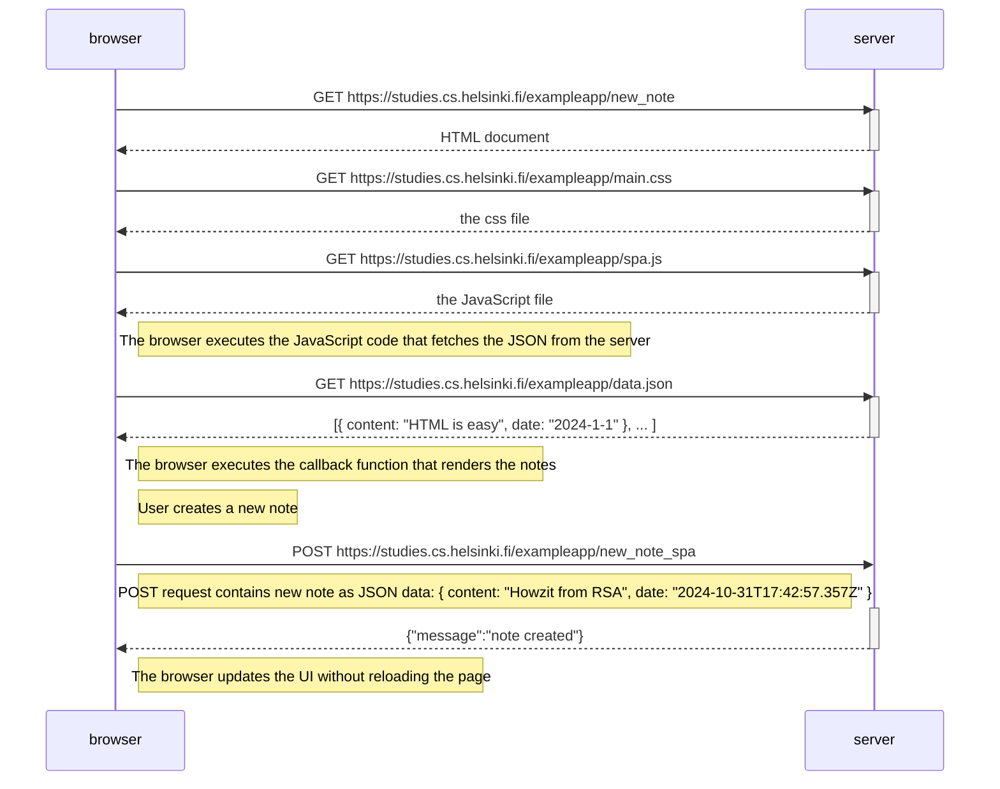

```mermaid
sequenceDiagram
    participant browser
    participant server

    browser->>server: GET https://studies.cs.helsinki.fi/exampleapp/new_note
    activate server
    server-->>browser: HTML document
    deactivate server

    browser->>server: GET https://studies.cs.helsinki.fi/exampleapp/main.css
    activate server
    server-->>browser: the css file
    deactivate server

    browser->>server: GET https://studies.cs.helsinki.fi/exampleapp/spa.js
    activate server
    server-->>browser: the JavaScript file
    deactivate server

    Note right of browser: The browser executes the JavaScript code that fetches the JSON from the server

    browser->>server: GET https://studies.cs.helsinki.fi/exampleapp/data.json
    activate server
    server-->>browser: [{ content: "HTML is easy", date: "2024-1-1" }, ... ]
    deactivate server

    Note right of browser: The browser executes the callback function that renders the notes

    Note right of browser: User creates a new note
    
    browser->>server: POST https://studies.cs.helsinki.fi/exampleapp/new_note_spa
    Note right of browser: POST request contains new note as JSON data: { content: "Howzit from RSA", date: "2024-10-31T17:42:57.357Z" }
    activate server
    server-->>browser: {"message":"note created"}
    deactivate server
    
    Note right of browser: The browser updates the UI without reloading the page
```